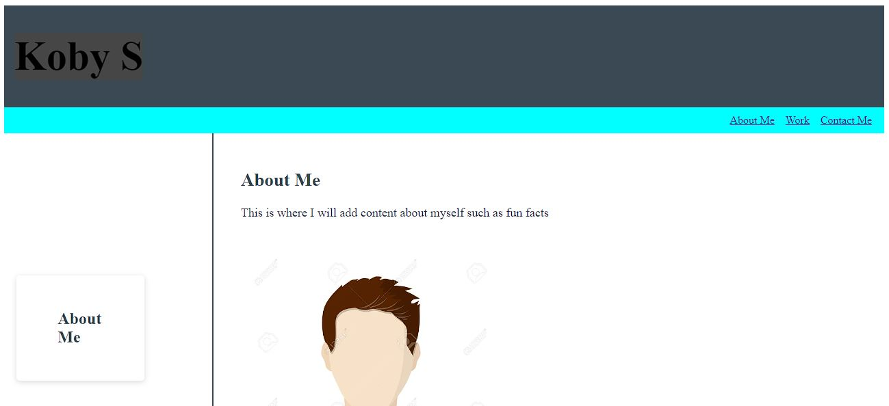

# Week 2 Challenge

## Description

This page will serve as a home page for my projects.

## Table of contents

-[About Me](#about-me)
-[Work Experience](#work)
-[Contact Information](#contact-me)

## Installation

This is  link to the code repository https://github.com/KobyS82/Week-2-challenge

## Usage

This is a live page that can be viewed at https://kobys82.github.io/Week-2-challenge/

 

## Credits

W3 School, Helping HTML semantics and CSS elements, https://www.w3schools.com/html/default.asp

Bradley O'Dell - TA, Helping with CSS Flexbox

James Kelly, Helping with bugs and the README file

123RF, For stock photos, https://www.123rf.com/photo_126045782_stock-vector-vector-illustration-of-avatar-and-dummy-sign-collection-of-avatar-and-image-stock-symbol-for-web.html

BBC, For stock photos, https://www.bbc.com/news/education-39217548

